# SOHI Bakery E-Commerce System

## Project Overview

SOHI Bakery is a full-stack e-commerce web application developed for an online bakery business. The system allows customers to browse bakery products, place orders, upload proof of payment, track their orders, and submit product reviews. It also provides an administrative dashboard where administrators can manage products, categories, customers, orders, and customer reviews.

The project follows a RESTful API architecture with secure user authentication using JSON Web Tokens (JWT). It was developed to provide a user-friendly online shopping experience while giving administrators complete control over bakery operations.

---

---

# 📸 System Screenshots

## 👤 Customer Pages

### Home Page

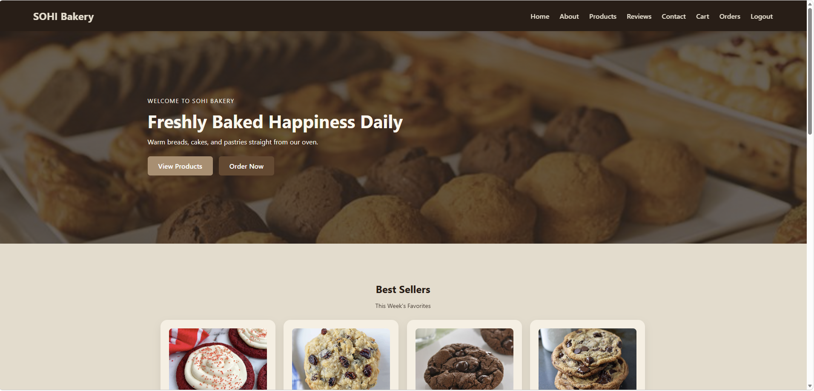

---

### Login Page

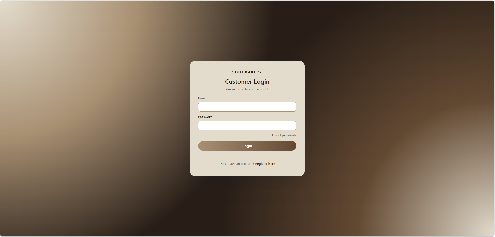

---

### Registration Page

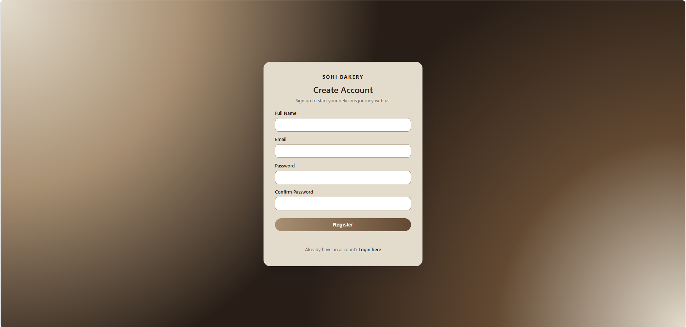

---

### Product Catalog

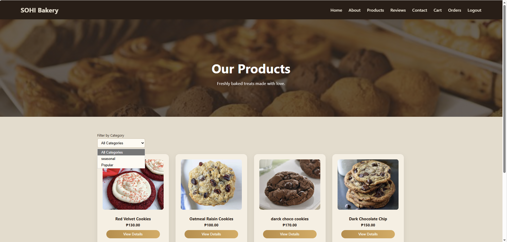

---

### Product Details

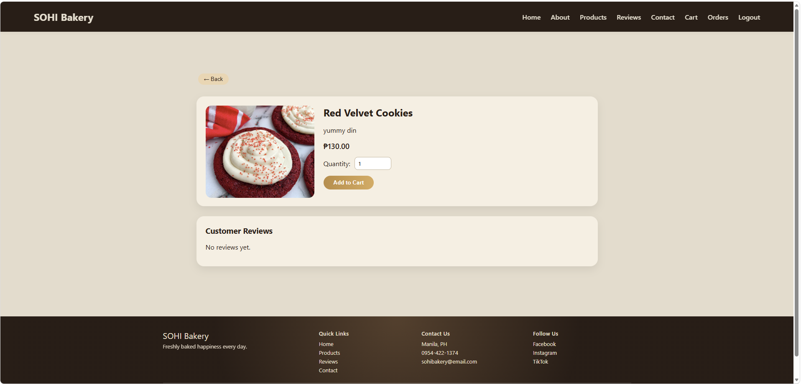

---

### Shopping Cart

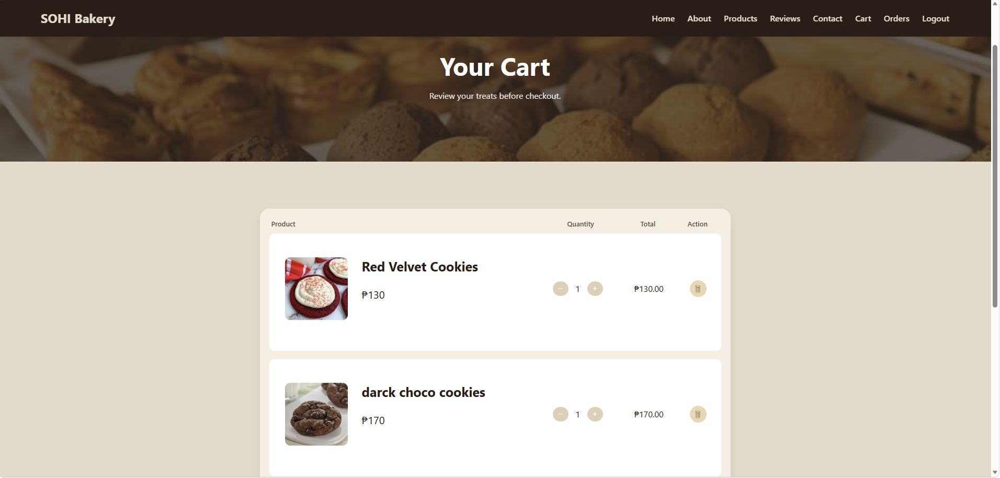

---

### Checkout

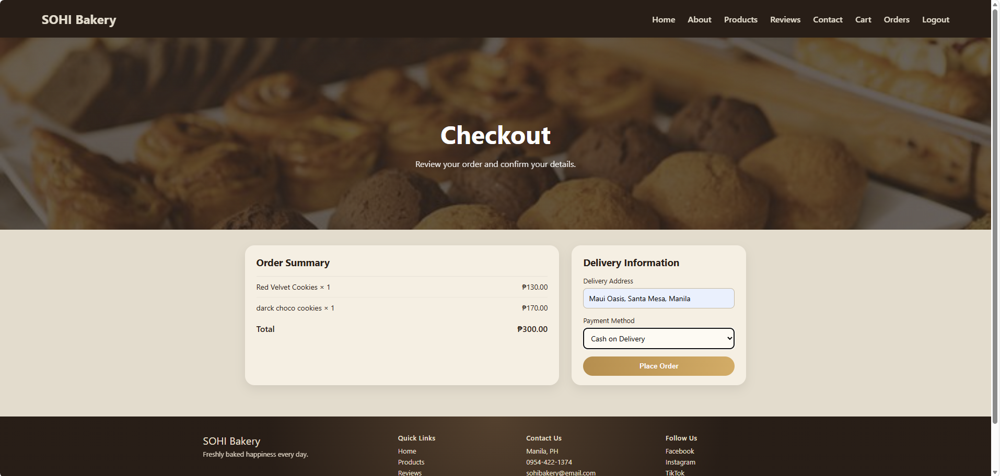

---

### My Orders

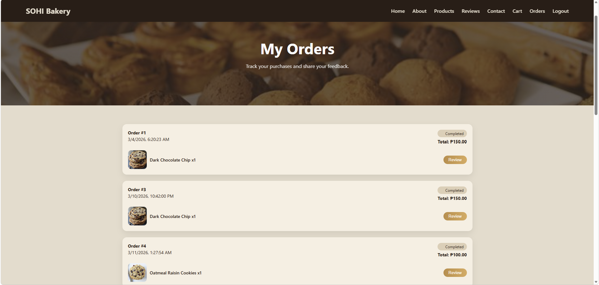

---

## 👨‍💼 Administrator Pages

### Dashboard

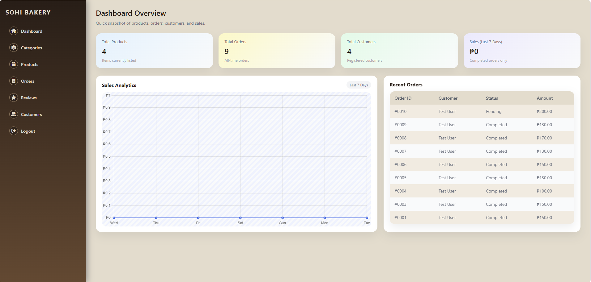

---

### Product Management

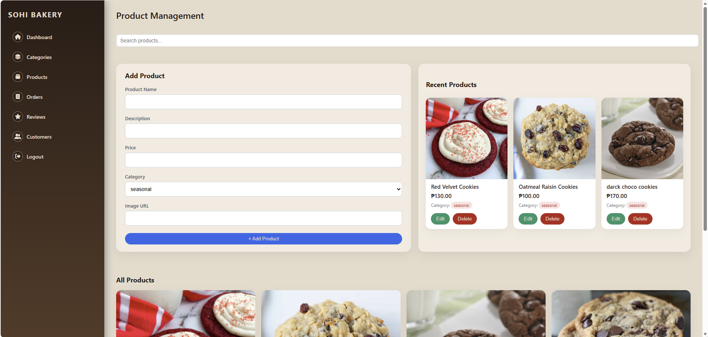

---

### Order Management

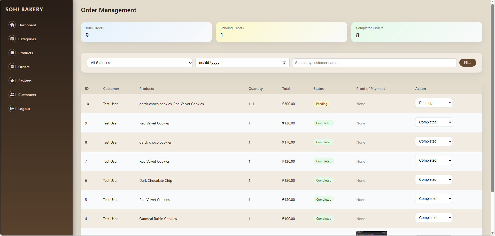

---

### Customer Management

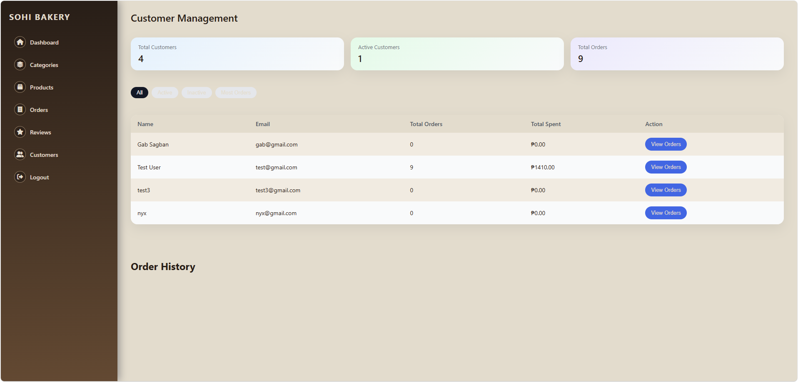

---

# Features

## Customer Features

- User Registration
- Secure Login using JWT Authentication
- Forgot Password
- Browse Bakery Products
- Product Categories
- Search Products
- View Product Details
- Place Orders
- Cash on Delivery (COD)
- Upload Proof of Payment
- View Order History
- Submit Product Reviews after Completed Orders

## Administrator Features

- Dashboard Overview
- Sales Analytics
- Product Management (Create, Read, Update, Delete)
- Category Management
- Customer Management
- Order Management
- Update Order Status
- Review Moderation
- Search and Filter Products, Orders, Customers, and Reviews

---

# Technologies Used

## Frontend

- HTML5
- CSS3
- Vanilla JavaScript
- Chart.js
- Font Awesome

## Backend

- Node.js
- Express.js
- MySQL2
- JSON Web Token (JWT)
- BCrypt
- Multer
- dotenv

## Database

- MySQL

---

# Development Tools

| Tool | Purpose |
|------|---------|
| Visual Studio Code (VS Code) | Frontend Development |
| Visual Studio Code (VS Code) | Backend Development |
| MySQL Workbench | Database Design and Management |
| Node.js | JavaScript Runtime |
| Git | Version Control |
| GitHub | Repository Hosting |

---

# HOW TO RUN THE PROJECT

## 1️ Setup the Database

1. Download the zip file  
2. Open MySQL Workbench  
3. Create a new database:

```sql
CREATE DATABASE sohi_bakery;
```

4. Import the provided SQL file into the `sohi_bakery` database.

5. Open `backend/src/config/db.js`

6. Change the MySQL username and password according to your MySQL Workbench credentials.

---

## 2️ Run the Backend

Open your terminal and run:

```bash
cd backend
npm install
npm run dev
```

---

## 3️ Run the Frontend

After the backend is running:

Open the HTML file inside the **frontend** folder in your browser.

---

# DEFAULT LOGIN ACCOUNTS

## Admin Account

- Email: natalie@gmail.com  
- Password: admin123  

---

## Customer Account

- Email: test@gmail.com  
- Password: 123456

## Developer

This project was developed as a full-stack bakery e-commerce system using HTML5, CSS3, JavaScript, Node.js, Express.js, MySQL, JWT Authentication, BCrypt, Chart.js, and Multer.

### Development Environment

- **Frontend:** Visual Studio Code (VS Code)
- **Backend:** Visual Studio Code (VS Code)
- **Database:** MySQL Workbench
- **Version Control:** Git and GitHub
